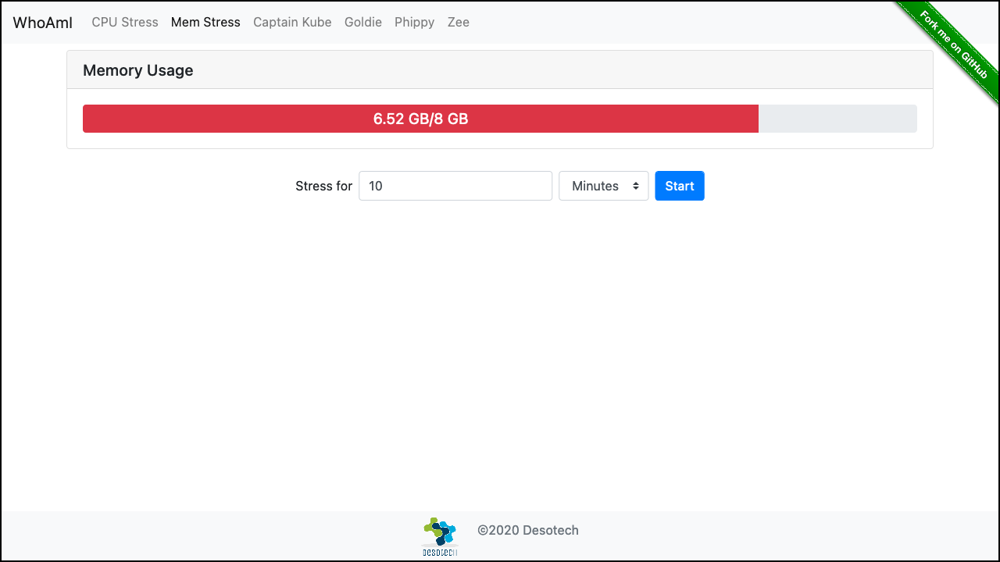

# Whoami

> **DesoLabs by Desotech** — Kubernetes demo and training application.

Whoami is a Go web app designed for Kubernetes training labs. It displays system information (hostname, network interfaces, HTTP request details), provides stress-test endpoints, Prometheus metrics, health/readiness probes, and a comprehensive set of diagnostic tools. Every page includes built-in lab documentation and supports dual output: **HTML** for browsers, **ASCII tables** for `curl`.

## Screenshot



## Quick Start

### Run locally

```sh
make
./bin/whoami -p 8080
```

### Docker

```sh
docker build -t whoami .
docker run -p 8080:80 whoami
```

### Kubernetes (kubectl)

```sh
kubectl run whoami --image=r.deso.tech/whoami/whoami:0.6.0 --port=80
kubectl expose pod whoami --type=NodePort --port=80
```

### Helm

```sh
helm install whoami ./helm/whoami

# With custom values
helm install whoami ./helm/whoami \
  --set replicaCount=3 \
  --set env.READINESS_DELAY=0s \
  --set ingress.enabled=true \
  --set ingress.hosts[0].host=whoami.example.com
```

### Kustomize

```sh
# Base
kubectl apply -k kustomize/base

# Dev overlay (1 replica, no delays, Goldie character)
kubectl apply -k kustomize/overlays/dev

# Production overlay (3 replicas, HPA, Ingress)
kubectl apply -k kustomize/overlays/production
```

## Endpoints

### System Info

| Endpoint | Method | Description |
|----------|--------|-------------|
| `/` | GET | Host & Network: hostname, network interfaces, HTTP request, client info |
| `/env` | GET | Environment variables |
| `/k8s` | GET | K8s Metadata (Downward API: pod name, namespace, node, IP, service account) |
| `/resources` | GET | Resource Limits (cgroup v1/v2) |
| `/volumes` | GET | Mounted volumes |
| `/osinfo` | GET | OS & Runtime info (GOOS, GOARCH, Go version, CPUs, uptime) |
| `/dns` | GET | DNS Config (resolv.conf: nameservers, search domains, options) |

### HTTP Tools

| Endpoint | Method | Description |
|----------|--------|-------------|
| `/headers` | GET | Echo all HTTP request headers |
| `/status` | GET | Return a specific HTTP status code (`?code=503`, range 100-599) |
| `/delay` | GET | Delayed response (`?duration=5s`, max 60s) |
| `/counter` | GET | Global request counter |

### Resilience

| Endpoint | Method | Description |
|----------|--------|-------------|
| `/healthz` | GET | Liveness probe (HTTP 200 or 503) |
| `/readiness` | GET | Readiness probe (HTTP 200 or 503) |

### Networking

| Endpoint | Method | Description |
|----------|--------|-------------|
| `/downstream` | GET | Call a downstream service (`?url=http://other-svc/`) |
| `/ws` | GET/WS | WebSocket echo test (HTML client + WebSocket endpoint) |

### Stress Test

| Endpoint | Method | Description |
|----------|--------|-------------|
| `/cpustress` | GET/POST | CPU usage overview. POST to stress all cores for a given duration |
| `/memstress` | GET/POST | Memory usage overview. POST to allocate memory for a given duration |

### Monitoring

| Endpoint | Method | Description |
|----------|--------|-------------|
| `/metrics` | GET | Prometheus metrics (Go runtime) |
| `/cpuusage` | GET | JSON: current CPU usage per core |
| `/memusage` | GET | JSON: current memory usage |

### Characters

| Endpoint | Method | Description |
|----------|--------|-------------|
| `/captainkube` | GET | Captain Kube character + system info |
| `/goldie` | GET | Goldie character + system info |
| `/phippy` | GET | Phippy character + system info |
| `/zee` | GET | Zee character + system info |

### Documentation

| Endpoint | Method | Description |
|----------|--------|-------------|
| `/docs` | GET | Built-in API reference with all endpoints, parameters, and env vars |

## Environment Variables

### Application Config

| Variable | Default | Description |
|----------|---------|-------------|
| `HEALTH_DELAY` | `0s` | Delay before liveness probe returns 200 |
| `READINESS_DELAY` | `15s` | Delay before readiness probe returns 200 |
| `STARTUP_DELAY` | `0s` | Delay before HTTP server starts accepting connections |
| `SHUTDOWN_DELAY` | `0s` | Delay before graceful shutdown completes |
| `LOG_INTERVAL` | `2s` | CPU/memory logging interval (`0` to disable) |
| `NAME_APPLICATION` | _(none)_ | Override landing page: `goldie`, `zee`, `captainkube`, `phippy` |

### Kubernetes Downward API

| Variable | Source | Description |
|----------|--------|-------------|
| `POD_NAME` | `metadata.name` | Pod name (falls back to hostname) |
| `POD_NAMESPACE` | `metadata.namespace` | Namespace |
| `NODE_NAME` | `spec.nodeName` | Node name |
| `POD_IP` | `status.podIP` | Pod IP address |
| `SERVICE_ACCOUNT` | `spec.serviceAccountName` | Service account name |

> Duration values are parsed by [time.ParseDuration](https://pkg.go.dev/time#ParseDuration). Plain integers are treated as seconds.

## Architecture

- **Go 1.26** with static binary (`CGO_ENABLED=0`)
- Multi-arch: **linux/amd64**, **linux/arm64**
- Multi-stage Docker build → minimal **Alpine 3.21** runtime image
- MVC-like structure: `app/` (model), `server/` (controller), `view/` (templates)
- Prometheus metrics via `client_golang`
- WebSocket support via `gorilla/websocket`
- Graceful shutdown with `SIGTERM`/`SIGINT` handling
- Structured logging via `logrus`

## Project Structure

```
.
├── main.go                     # Entry point
├── app/                        # Configuration, system info, health probes, logging
├── server/                     # HTTP handlers and routing
│   └── util/                   # Request parsing, JSON responses, stress generators
├── view/                       # View interface + HTML/text rendering
│   └── util/                   # Terminal output (ASCII tables, image-to-text)
├── template/                   # Go HTML templates (base layout + pages)
├── static/                     # CSS, JS, images (Bootstrap, K8s characters)
├── helm/whoami/                # Helm chart
├── kustomize/                  # Kustomize base + overlays (dev, production)
├── Dockerfile                  # Multi-stage Linux build
├── Makefile                    # Build, cross-compile, Docker targets
├── unix.mk                    # Unix-specific Make variables
└── .github/workflows/
    └── release.yaml            # CI: build images + GitHub release on tag push
```

## Build

```sh
# Default build (current OS/arch)
make

# Cross-compile all platforms
make xcompress

# Docker (linux/amd64 + linux/arm64)
make docker

# Clean
make clean
```

## CI/CD

The release pipeline triggers on `v*` tag pushes and:

1. Builds and pushes Linux images (amd64 + arm64) to `r.deso.tech`
2. Creates multi-arch manifest lists (versioned + latest)
3. Publishes a GitHub Release with cross-compiled archives

## License

MIT — See [LICENSE](LICENSE) for details.
